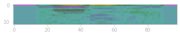

# AUDIO GENDER RECOGNITION 


## NON-TECHNICAL DESCRIPTION

This project aims to demonstrate the principal of a Convolutional Neural Network, which can 
distinguish male from female voices based on a short audio recording of a human voice. Upon receiving
an audio input, the software will return a classification 'male' or 'female'. 

The software has been trained using a large number of recordings of human adults saying a single digit i.e. 0-9. 

## DATA

The data used to train and validate this solution is AudioMNIST. It is widely used to train deep and/or convolutional neural 
networks for speech-recognition tasks. In this project the dataset is used to train a CNN to classify audio input as 
either male or female depending on the speaker.

The dataset was created by Becker et al and is available here: https://github.com/soerenab/AudioMNIST.
The creators of the dataset request that projects using their work cite the following paper:

| Paper Title   | Interpreting and Explaining Deep Neural Networks for Classification of Audio Signals                       |
|---------------|------------------------------------------------------------------------------------------------------------|
| Journal       | CoRR                                                                                                       |
| Volume        | abs/1807.03418                                                                                             |
| Year          | 2018                                                                                                       |
| ArchivePrefix | arXiv                                                                                                      |
| Eprint        | 1807.03418                                                                                                 |
| Authors       | Becker, Sören and Ackermann, Marcel and Lapuschkin, Sebastian and Müller, Klaus-Robert and Samek, Wojciech |

These data must be preprocessed in order to make them suitable for processing by a convolutional neural network.
Preprocessing includes adding a specific form of emphasis, as well as padding. Padding ensures that the resulting input 
has the same length irrespective of audio sample. 
The AudioMNIST preprocessing code in included in this project in the Jupyter notebook 
```setup/01_preprocess_audiomnist.ipynb```.  

Running this script will write MFC images to the folder mfc_dataset.
By running the shell script ```pre_dataset.sh``` a meaningful subset of these 
images are copied to ```train``` and ```val``` subdirectories of the folder ```mfc_dataset_train_test```. 

After running this script, the generated files can be moved to the
```input``` directory by running the shell script ```setup/02_prep_datset.ipynb```

Once the project is set up (by preprocessing AudioMNIST files as described above) there are two main programs that can be run:
```src/search.py``` and ```src/train.py```. 

```src/search.py``` uses the skorch library in conjunction with sklearn's GridSearchCV to perform an exploration
of a limited set of hyperparameters. Search results are dropped into subfolders of the ```outputs``` directory.
The subfolders ```search_N``` contain a YML file which describes the values of the hyperparameters that deliver the best
score.

```src/train.py``` performs a training/validation run and posts outputs intn subfolders of the ```outputs``` directory.
The subfolders ```run_N``` contain plots of accuracy and loss over the number of epochs performed.


## MODEL 

The model chosen to perform this task is a Convolutional Neural Network (CNN). The CNN does not process audio samples (in the ```wav``` format) directly, but instead processes an image representation (in the ```jpg``` format) of the original audio. The image represents a so-called Mel-frequency cepstrum (MFC). For example, the following MFC image represents a female saying the digit "zero": 


 
These RGB images have shape 98x12x3, and the CNN is specifically designed to process shapes of this kind.                                

## HYPERPARAMETER OPTIMSATION

Using popular libraries, I performed an exhaustive grid search of the following hyperparameters and values:

| Parameter     | Value 1 | Value 2 | Value 3 | Value 4 |
|---------------|---------|---------|---------|---------|
| Epochs        | 5       | 10      | 20      | 25      |
| Learning rate | 0.01    | 0.001   | 0.005   | 0.0005  |


## RESULTS

Prior to hyperparameter optimisation accuracy came in at 50%, which is no better than random. The hyperparameter
grid search resulted values of *epochs = 25* and a *learning rate (lr) = 0.001*. This result in an accuracy of >95%.
The best results obtained after hyperparameter optimisation are described in the file ``model_card.md``. 

 
## NOTES ON HARDWARE AND PROCESSING SPEED

The project tries to exploit specialised hardware, if present. Training was performed on a Mac M1 Max with both CPU 
and MPS (Mac M1 GPU). Switching from CPU to GPU results in a 3-fold increase in training speed. The project will 
automatically detect cuda or mps hardware if present. Program arguments can be used to disable these options of required.
Note: Hyperparameter tuning did not work with MPS (bug in underlying library?). However, training was accelerated by 
factor of 3.

## CONTACT DETAILS

Mike Mannion B.Sc. (hons) MBA
michaelmannion@me.com

 

