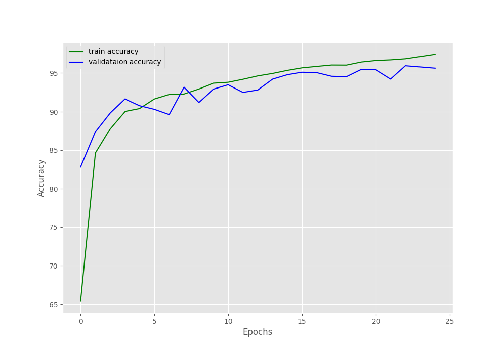
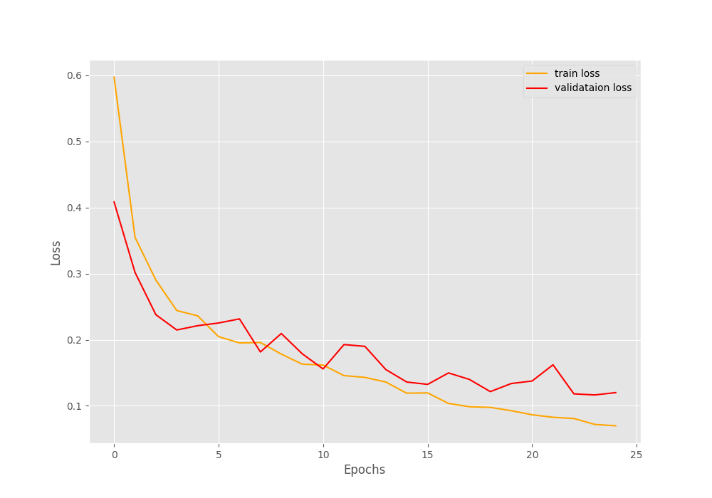

# Model Card

## Model Description

**Input:**

The model input is a 98x12x3 (3=RGB) Mel-frequency cepstrum (MFC) image. An MFC is a 
short-term power spectrum of an audio sample. MFC is often used to extract features
from audio. In this project we are attempting to distinguish adult male from
adult female voices.

For more information on MFC, see https://en.wikipedia.org/wiki/Mel-frequency_cepstrum

The model therefore does not work with audio directly. Instead， an audio sample is
converted to an MFC image using some utility code, which for convenience is included
in this project. The preprocessing code produces objects, which are already of the correct
shape for input to the model. This saves us having to resize the inputs when loading  
data.

**Output:**

The model performs a binary classification, and therefore outputs a zero or a one depending on whether the input corresponds to a female or a male voice. 

**Model Architecture:**

| Layer (type)   | Output Shape      | Param #                           |
|----------------|-------------------|-----------------------------------|
| Conv2d-1       | [-1, 32, 98, 12]  | 896                               |
| ReLU-2         | [-1, 32, 98, 12]  | 0                                 |
| MaxPool2d-3    | [-1, 32, 49, 6]   | 0                                 |
| Conv2d-4       | [-1, 64, 49, 6]   | 18,496                            |
| ReLU-5         | [-1, 64, 49, 6]   | 0                                 |
| MaxPool2d-6    | [-1, 64, 24, 3]   | 0                                 |
| Linear-7       | [-1, 128]         | 589,952                           |
| ReLU-8         | [-1, 128]         | 0                                 |
| Linear-9       | [-1, 2]           | 258                               |

| Model Metric                    | Value   |
|---------------------------------|---------|
| Total params                    | 609,602 |
| Trainable params                | 609,602 |
| Non-trainable params            | 0       |
| Input size (MB)                 | 0.01    |
| Forward/backward pass size (MB) | 0.97    |
| Params size (MB)                | 2.33    |
| Estimated Total Size (MB)       | 3.31    |

## Performance

             

Following 25 epochs:

Training loss: 0.070, training acc: 97.411

Validation loss: 0.120, validation acc: 95.625

## Limitations

The primary aim of the project was to demonstrate understanding, as opposed to achieving high accuracy. 
Given that this was the author's first shot at creating a CNN for processing audio, it is highly likely that accuracy 
would be improved with further work.

The AudioMNIST dataset comprises a highly homogenous set of audio files. Sampling rates and other audio metrics are consistent.
If this project were to be used in the real world, then it would need to be able to handle audio samples with different
audio characteristics. However, this is likely to be a question of pre-processing rather than modelling.

## Trade-offs

The main trade-off was already expressed under Limitations: The model was designed for demonstration as opposed to performance. The relative simplicity of the model comes at the expense of accuracy.
Furthermore, due to time constraints only two hyperparameters were explored using a grid search. If this search were to widened
to include more hyperparameters, optimisation algorithms, adjustments to the number of layers in the model, then it is quite possible that the performance could be
further improved.
